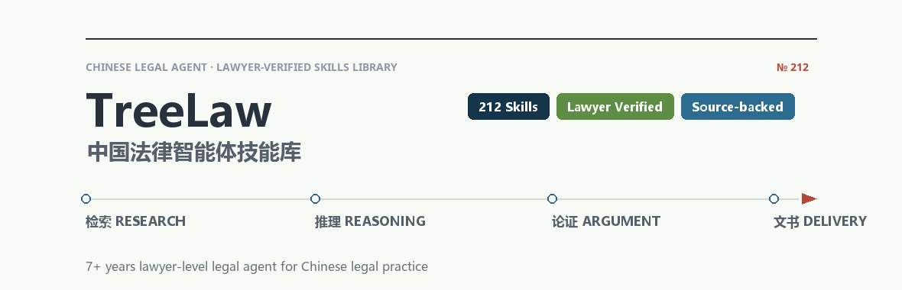
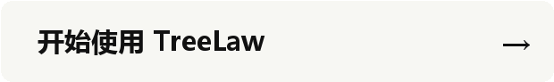
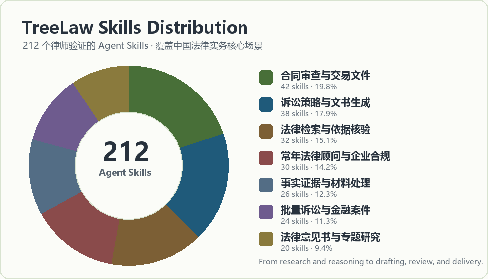
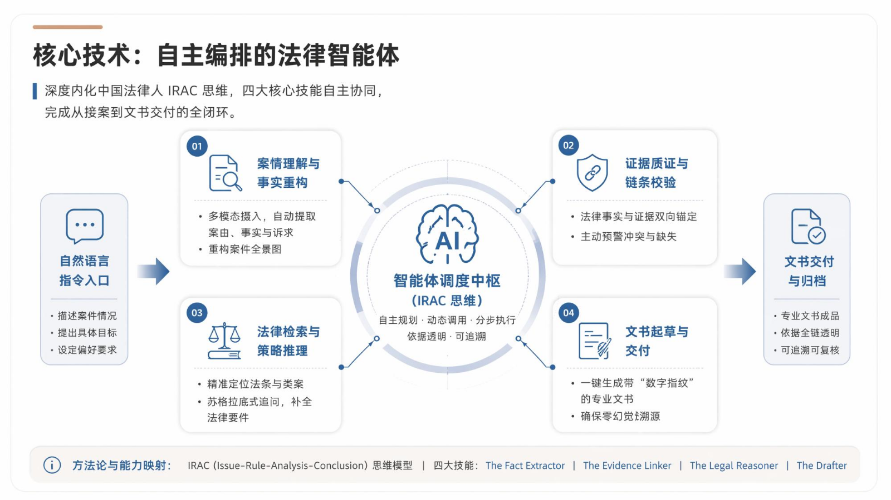
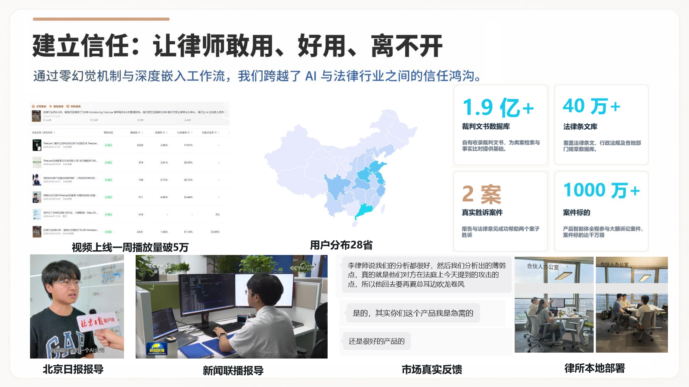

# TreeLaw

  

**十年以上执业律师水平的中国法律智能体。** 
212 个由执业法律专业人员手写并验证的法律智能体技能（Agent Skills），覆盖诉讼律师、非诉律师、常年法律顾问和企业合规团队，贯穿检索 → 推理 → 论证 → 文书 → 交付的完整链条。

A curated library of 212 hand-crafted, lawyer-verified legal agent skills for Chinese legal practice, covering litigation lawyers, transactional lawyers, general counsel, and corporate compliance teams.

[技能总览](#skill-index) · [设计理念](#自主编排的法律智能体) · [评测覆盖](#真实律师工作流打磨) · [使用方式](https://treelaw.top) · [贡献技能](https://treelaw.top)

  

TreeLaw 不是一个泛用聊天机器人。它是面向中国法律实务构建的法律 Agent，把诉讼律师、非诉律师、常年法律顾问和企业合规团队的工作流，拆成可执行、可核验、可交付的专业技能。

[访问官网](https://treelaw.top) · [开始使用](https://treelaw.top) · [Skill（技能）](https://treelaw.top)

## Skill Index

TreeLaw 的核心不是“回答法律问题”，而是把中国律师真实工作中的判断、检索、核验、起草、复核和交付拆成可编排的 Skills。

下面是当前公开展示的一部分 TreeLaw Skills。每个 Skill 都可以在 TreeLaw Agent 中被组合、调用，并与文件读取、OCR、法律检索、文书生成和人工确认环节衔接。

  

  

> **理论依据** IRAC 争点分析、请求权基础检索、类案检索、法条体系解释、裁判规则归纳、法律依据可追溯核验。

把案件事实拆成可检索的争点、要件和抗辩路径。

围绕国家法律法规、司法解释、部门规章和裁判规则核验依据。

根据案号、法院、当事人和裁判要旨核验已知案例。

寻找同争点、同法院层级或同地区裁判倾向下的有利案例。

主动整理不利观点、不利案例和对方可能引用的材料。

对输出中的法条、案例和政策依据做可追溯核查。

  

> **理论依据** 证据三性、证明责任分配、事实要件映射、材料索引、OCR 来源追踪、矛盾事实比对。

把事实、证据、证明目的和页码来源整理成可复核目录。

扫描件 OCR 后保留原文、页码和字段来源，便于人工确认。

按法律要件建立证据链，识别证明缺口和补强方向。

比对合同、流水、聊天记录和陈述中的冲突信息。

从材料中抽取起诉状、答辩状和法律意见书所需事实。

  

> **理论依据** 请求权基础、诉讼请求设计、举证责任、程序节点、庭审争点整理、救济路径规划。

从请求权基础、举证责任、程序节点和诉讼目标生成策略图。

根据案件台账和证据结构生成民事起诉状。

组织答辩意见、反诉路径和抗辩要点。

生成财产保全、证据保全和行为保全申请材料。

整理庭审提纲、发问清单、质证意见和争点回应。

评估上诉、再审、执行和和解路径。

  

> **理论依据** 交易结构还原、合同目的解释、权利义务配置、违约责任设计、风险分配、商业谈判可执行性。

先识别交易结构、主体关系和履约路径，再审条款。

按客户立场审查付款、交付、验收、违约、解除和争议解决。

给出可替换条款、红线修改意见和谈判口径。

识别缺失条款、冲突条款和表述不确定条款。

围绕主体资格、授权链条、履约能力和监管风险做初筛。

把审查意见转化为可执行的谈判优先级。

  

> **理论依据** 标准化台账、OCR 人工确认、金融借款/担保/还款事实核验、模板化文书生成、批量质量控制。

从合同、扫描件、流水和还款记录中批量生成标准台账。

生成可视化核验页，让实习生或律师确认关键字段。

核对本金、利息、罚息、逾期金额和律师费。

把确认台账填入起诉状、委托书、条件表和证据目录模板。

批量生成证据目录、附件清单和可追溯材料包。

检查主体、金额、日期、案由和模板字段是否一致。

  

> **理论依据** 企业法律问题分诊、制度治理、授权链条、劳动用工、数据合规、公司治理和业务风险闭环。

把日常法律问题分流到合同、劳动、公司治理、合规或诉讼路径。

围绕业务流程识别制度、授权、数据、用工和监管缺口。

生成制度、流程、通知、函件和内部合规文件初稿。

处理劳动用工、个人信息保护和数据出境相关问题。

核查股东会、董事会、授权、印章和内部审批规则。

审查或生成决议、会议纪要和授权文件。

  

> **理论依据** 法律意见书结构、事实与问题分离、依据检索、风险矩阵、管理层决策表达。

按事实、问题、依据、分析、结论和风险边界生成法律意见书。

围绕行业监管、地方规则和最新政策生成专题研究。

把法律风险转化为概率、影响、依据和整改动作矩阵。

输出带来源、适用条件和人工复核提示的研究备忘录。

把复杂法律分析压缩成管理层可读的决策简报。

## 自主编排的法律智能体

TreeLaw 通过技能路由、工具调用、文件读取、OCR、法律检索、引用核验和文书生成，把一个开放式法律任务拆成多个可复核步骤。它强调的是“律师能接着用的结果”，而不是单轮问答。

  

## 真实律师工作流打磨

TreeLaw 的技能体系来自真实法律工作，而不是只把法律文本塞进模型。

- 200+ 专家技能，覆盖诉讼、非诉、合同、合规、常年法律顾问和企业自查。
- 两家红圈所、三家精品所律师参与使用、反馈和实务打磨。
- 全国 26 座城市的律师用户已经参与使用与测试。
- 上千名律师正在进入 TreeLaw 的真实工作流测试。
- 已有真实案件中，律师借助 TreeLaw 的类案检索和引用核验定位有利案例，并转化为诉讼论证材料。
- 经验来源覆盖中关村学院、北京理工大学、天津大学、厦门大学法学院，以及红圈所、精品所和地方律协相关实践。

  

## 参与测试 / 提交技能

如果你对中国法律 AI 感兴趣，或者希望 TreeLaw 支持你的真实法律工作流，可以从官网开始使用并加入内测。请不要在公开仓库中粘贴客户姓名、合同正文、身份证号、案号、手机号、商业秘密或其他敏感信息。

  
  

官网：[https://treelaw.top](https://treelaw.top)

## English Summary

TreeLaw is a China-focused legal AI agent designed around real lawyer workflows. It targets lawyer-level legal research, citation verification, contract review, litigation drafting, batch litigation document generation, source-backed legal reasoning, and human-in-the-loop review for Chinese legal practice.

Website: [https://treelaw.top](https://treelaw.top)
