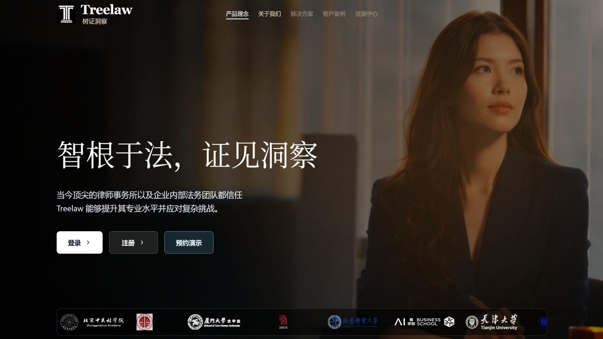
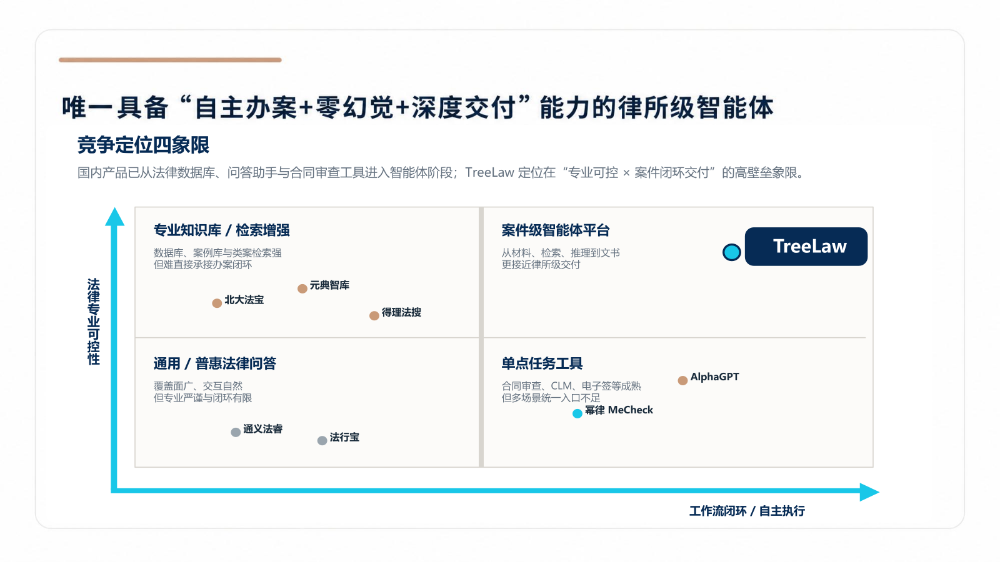
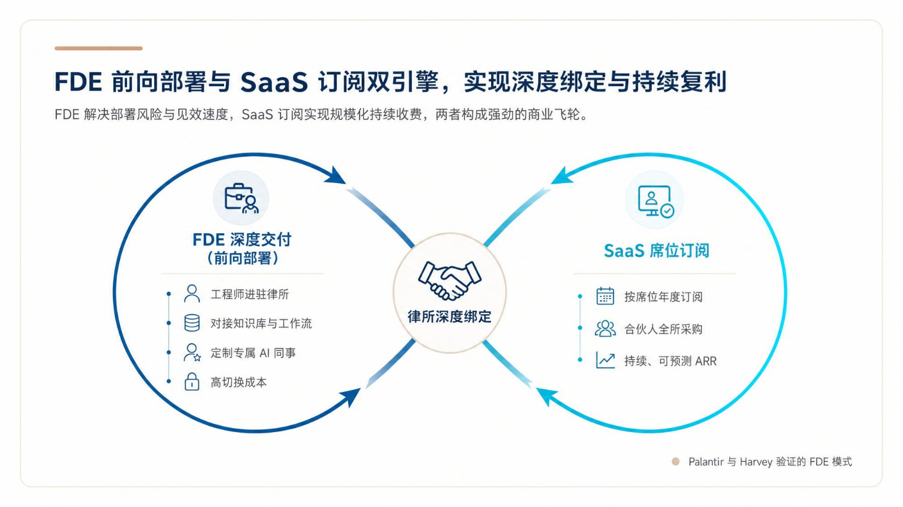
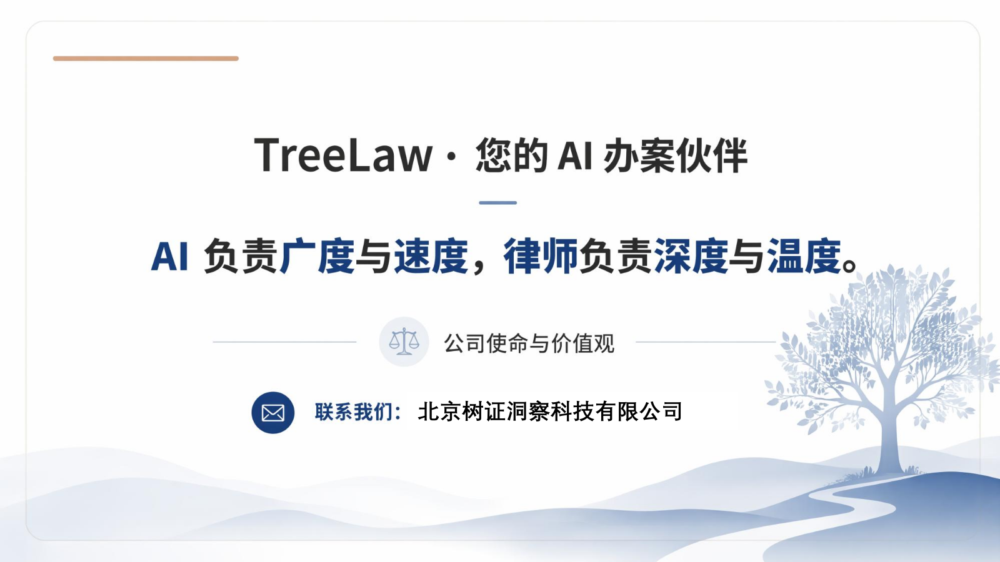

# TreeLaw

  

**7 年以上职业律师水平的中国法律智能体。** 
更适合中国法律体系，也更适合中国律师真实工作方式。

TreeLaw 不是一个泛用聊天机器人。它是面向中国法律实务构建的法律 Agent，把诉讼律师、非诉律师、常年法律顾问和企业合规团队的工作流，拆成可执行、可校验、可交付的专业技能。

[访问官网](https://treelaw.top) · [申请内测](https://treelaw.top) · [提交工作流建议](../../issues/new/choose)

## What Makes TreeLaw Different

通用 AI 往往会给出“看起来像法律意见”的回答，但律师真正需要的是：事实能定位，证据能对应，法条和案例能核验，最终能落到检索报告、合同审查意见、起诉状、法律意见书和证据目录上。

TreeLaw 的目标是让中国律师少做重复劳动，把注意力放回判断、策略和客户沟通。

  

## Core Workflows

### 单案完整法律检索

面向一个具体案件，TreeLaw 可以从争议焦点开始拆解检索路径，而不是只返回一组关键词结果。

- 争点拆解：把事实争议、法律争议、程序争议拆成可检索问题。
- 法律依据检索：优先围绕中国法律法规、司法解释、指导案例、法院会议纪要和裁判规则组织依据。
- 已知案例核验：根据案号、法院、当事人、裁判要旨核验案例是否真实匹配。
- 有利案例检索：围绕同案由、同争点、同法院层级或同地区裁判倾向寻找可引用案例。
- 不利材料整理：主动列出对己方不利的案例、观点和可能抗辩。
- 裁判观点提炼：把检索结果转化为可直接进入代理意见、起诉状、答辩状或法律意见书的论证。

### 合同审查

TreeLaw 的合同审查不是只标红风险句子，而是按律师审查习惯重建交易。

- 识别交易结构、合同性质、主体资格、授权链条和履约路径。
- 审查付款、交付、验收、违约责任、解除、担保、管辖、争议解决等核心条款。
- 对缺失条款、冲突条款、表述不确定条款给出修订建议。
- 按客户立场输出风险等级、修改意见、谈判口径和可替换条款。

### 批量诉讼与材料生产

TreeLaw 支持从扫描件、台账、还款明细、合同附件到诉讼材料的批量处理。

- OCR 识别扫描件并生成可视化对照页。
- 提取标准台账字段，交由实习生或律师人工核验。
- 根据确认台账自动生成起诉状、授权委托书、合同条件表、证据目录等材料。
- 对关键金额、主体信息、合同编号、日期、还款记录和 OCR 来源保留可追溯线索。

### 常法、非诉与企业自查

TreeLaw 也在适配更多企业日常法律场景，包括制度审查、合规检查、劳动用工、数据合规、公司治理、投融资文件和长期顾问问答。

## Source-Backed Legal Reasoning

TreeLaw 的一个核心原则是：法律结论要尽量回到可核验的来源。

- 法条：围绕国家法律法规数据库、司法解释、部门规章、地方规范性文件等信源建立检索和核验路径。
- 案例：围绕裁判文书、指导案例、法院案例库、专业数据库和真实案号做核验。
- 政策与裁判规则：适配法院会议纪要、审判指引、类案规则和行业监管文件。
- 输出：尽量标明依据来源、适用条件、风险边界和需要人工复核的地方。

  

## Built With Lawyers

TreeLaw 的技能体系来自真实法律工作，而不是只把法律文本塞进模型。

- 200+ 专家技能，覆盖诉讼、非诉、合同、合规、常年法律顾问和企业自查。
- 两家红圈所、三家精品所律师参与使用、反馈和实务打磨。
- 全国 26 座城市的律师用户已经参与使用与测试。
- 上千名律师正在进入 TreeLaw 的真实工作流测试。
- 已有真实案件中，律师借助 TreeLaw 的类案检索和引用核验定位有利案例，并转化为诉讼论证材料。
- 经验来源覆盖中关村学院、北京理工大学、天津大学、厦门大学法学院，以及红圈所、精品所和地方律协相关实践。

  

## Product Philosophy

TreeLaw 关注的是“可交付结果”，而不只是模型回答。

- 对律师：减少检索、摘录、比对、格式化和重复起草时间。
- 对团队：把资深律师经验沉淀成可复用的工作流。
- 对客户：让法律服务更快、更透明，也更容易解释。
- 对开发者：把法律信源、技能路由、工具调用、材料生成和人工确认做成可持续演进的系统。

  

## For Builders And Researchers

我们欢迎对中国法律 AI 感兴趣的律师、法学院学生、研究者、工程师和机构参与测试。

你可以在 Issues 中提交：

- 你希望 TreeLaw 支持的法律工作流。
- 你遇到的法律 Agent 错误、幻觉或引用不准确问题。
- 你希望我们优先适配的法律信源、数据库或法院规则。
- 你愿意参与内测的场景和联系方式。

请不要在公开 Issue 中提交客户姓名、合同正文、身份证号、案号、手机号、商业秘密或其他敏感信息。真实材料请通过官网或私有沟通渠道提交。

## English Summary

TreeLaw is a China-focused legal AI agent designed around real lawyer workflows. It targets lawyer-level legal research, contract review, litigation drafting, batch litigation document generation, source-backed citation verification, and human-in-the-loop review for Chinese legal practice.

Website: [https://treelaw.top](https://treelaw.top)

## Join The Beta

  

If you are a lawyer, legal researcher, legal-tech builder, law student, or institution interested in Chinese legal AI, visit [treelaw.top](https://treelaw.top) or open an Issue in this repository.
